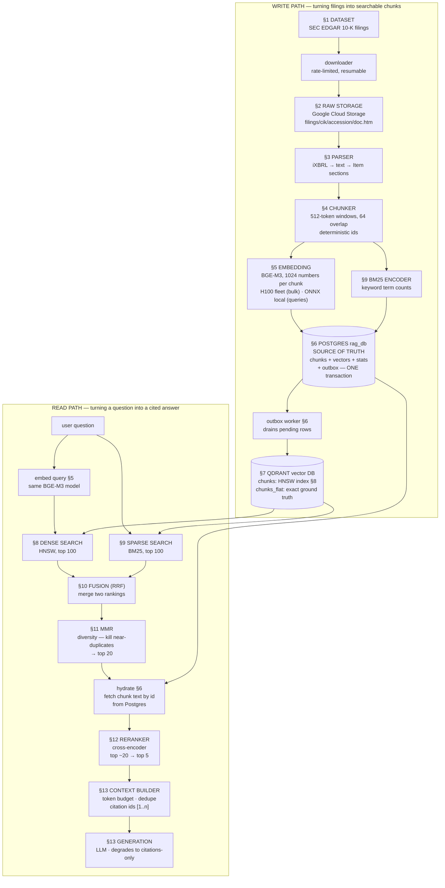
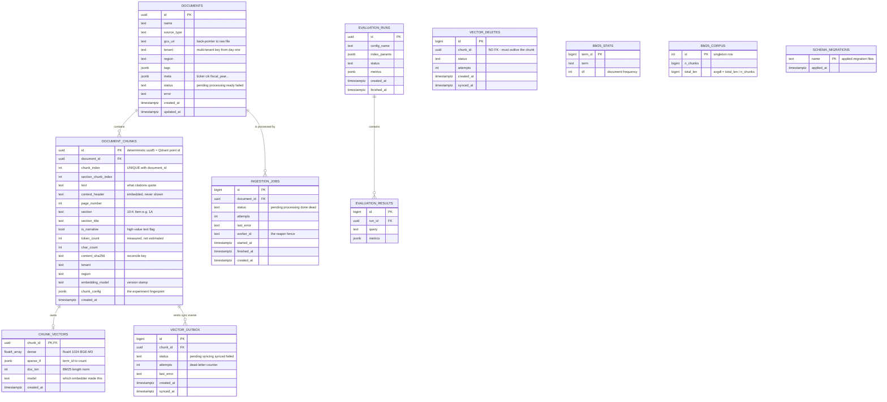

# The Component Atlas — every piece of this RAG system, explained

*What each component is, why we chose it, what the alternatives were, and a worked
example — grounded in the system you actually run: 6,947 SEC filings, 1,736,942
chunks, embedded with BGE-M3 (an open-source embedding model, §5) on a fleet of
H100s (NVIDIA's data-center GPU) rented from Modal (a serverless GPU cloud, §5).*

**First, what RAG even is.** RAG — *Retrieval-Augmented Generation* — is the pattern
where a language model doesn't answer from memory: the system first **retrieves** the
passages relevant to the question from a document collection, then the model
**generates** an answer *from those passages*, citing them. The retrieval half is
where all the engineering lives, and it's what this document dissects. Every term in
the diagram below (HNSW, BM25, RRF, MMR…) is defined in its numbered section — read
top to bottom and each concept arrives before it's needed, or with a pointer.

---

## 0. The architecture — every component and the flow

Node labels below are **section numbers in this document** — the diagram is the table
of contents.



---

## 1. The dataset — SEC 10-K filings

**What it is.** A 10-K is the annual report every US public company must file with the
SEC — audited, lawyer-reviewed, legally required to be truthful. Each is 50–300 pages
covering the same standardized sections ("Items"): Item 1 Business, Item 1A Risk
Factors, Item 3 Legal Proceedings, Item 7 Management's Discussion, Item 8 Financial
Statements, and so on.

**Where we got it.** SEC EDGAR (`sec.gov`) — free, public domain, no API key. Two
endpoints: `data.sec.gov/submissions/CIK{n}.json` lists a company's filings
(a **CIK** is the SEC's permanent per-company ID number), and
`sec.gov/Archives/edgar/data/{cik}/{accession}/{doc}` serves a document (an
**accession number** identifies one specific filing event). The only rule is fair use:
identify yourself in a `User-Agent` header, stay under 10 requests/second (we run ~6/s
— `scripts/download_corpus.py`).

**What we hold.** 6,947 filings — **872 distinct companies** (the ~1,150 largest US
tickers were attempted; foreign filers use form 20-F instead of 10-K and newer IPOs have
short histories), up to 10 fiscal years each spanning **FY2008–2026**, ~25 GB of raw
iXBRL HTML (**iXBRL** = "inline XBRL", *eXtensible Business
Reporting Language* — the SEC's format where human-readable HTML carries
machine-readable financial tags inside it; more in §3).

**Why this dataset — and what else we could have used.** Common alternatives: Wikipedia
(clean but every model memorized it — retrieval quality is hard to judge), news corpora
(licensing), arXiv (LaTeX parsing pain), synthetic docs (prove nothing). 10-Ks win
because:
- **Standardized structure** → section-aware parsing and metadata filtering become possible.
- **Both retrieval styles matter here**: meaning-based questions ("supply chain risks")
  *and* exact-term lookups ("Epic Games", "Item 1A", "$391,035 million") — which is why
  a hybrid retriever (§9–§10) is worth building at all.
- **A time dimension** — ten near-identical yearly filings per company is a brutal,
  realistic stress test for duplicate suppression (§11 earns its keep here).
- **Scale that forces real engineering** — 1.7M chunks means resumable pipelines,
  approximate nearest-neighbor (ANN) indexes (§8), and GPU batch embedding stop being
  optional.

---

## 2. Raw storage — Google Cloud Storage

**What it is.** Object storage: a durable key→bytes store in the cloud. No folders
really, no transactions, no queries — just PUT/GET blobs over HTTP, 99.999999999%
("eleven nines") durability, ~$0.02/GB-month.

**Where exactly.** `gs://llm-platform-services-bucket/filings/{cik}/{accession}/{doc}.htm`
— the key layout mirrors EDGAR's own identifiers, so every stored file maps 1:1 back to
its authoritative source.

**Why object storage for raw files.**
- **The raw filing is immutable evidence.** We never edit it, only re-derive from it.
  Write-once/read-occasionally/keep-forever is exactly what object storage is built for.
- **Decoupled from compute.** The laptop, the ingestion workers, and the GPU cloud can
  all reach the same bytes without sharing a disk.
- **Resumability for free.** "Does this blob exist?" is one cheap call — our downloader
  skipped 3,118 already-fetched files in seconds on its final verification pass.

**Alternatives and why not.**
| Option | Why we didn't |
|---|---|
| AWS S3 / Azure Blob | Equivalent products; this project lives on GCP |
| Local disk | Not durable, not shared, dies with the laptop |
| Postgres `bytea` columns | 25 GB of HTML inside the relational DB bloats backups and buys nothing — raw bytes never need transactions |
| Re-fetch from EDGAR on demand | Couples every re-parse to SEC's rate limits; a full re-parse would take hours of polite crawling instead of minutes |

---

## 3. Parsing — iXBRL to clean sections

**The problem.** A modern 10-K `.htm` is human-readable HTML wrapped around thousands
of inline XBRL tags (machine-readable financial data for regulators), plus page
furniture — running footers, page numbers, "Table of Contents" back-links — sprayed
through the text.

**The techniques that exist, and why we chose ours.**
| Technique | What it is | Tradeoff |
|---|---|---|
| **DOM flatten + heuristics** *(ours)* | BeautifulSoup strips markup to text; regexes find section headers | Transparent, fast, free — but the edges need care |
| Purpose-built library (`sec-parser`) | Community parser that knows 10-K structure | Less control, another dependency, still imperfect |
| Layout/ML parsers (`unstructured.io`, Grobid) | Model-based document-element detection | Heavy, slower, PDF-oriented |
| LLM parsing | Ask a model to extract the sections | Hundreds of dollars and hours at 6,947 docs; non-deterministic |

**Why ours, explicitly:** it is *transparent* (every mis-parse is debuggable to a line
of code), *fast* (~10 s/doc — the full corpus re-parses in an evening), *free*, and
*deterministic* (same input → same output, which the whole idempotent pipeline relies
on). The cost is that edge cases must be found and engineered — and they were:

1. **Block-aware text extraction.** EDGAR wraps *single words* in nested styled spans.
   Naive extraction split words mid-letter — Microsoft's "RISK FACTORS" became
   "RIS K FACTORS" and its whole Risk Factors section vanished. Fix: inline content
   joins seamlessly; only true block tags (`p`, `div`, `tr`…) end lines.
2. **Item anchors.** Each of the 21 sections is found by a regex anchored on the item
   number plus a title keyword (`Item 1A … Risk Factors`), tolerant of `.` `:` `—`.
3. **In-order chain selection (the clever bit).** Every item title appears many times —
   table of contents, the real header, cross-references ("Refer to Item 1A…"). NVIDIA's
   *late* cross-reference used to steal the section under take-the-last-match. The fix
   exploits one invariant — *a 10-K presents Items in order* — and picks one match per
   item so positions strictly increase in item order, maximizing items placed, then
   total position (which beats the TOC — also an in-order chain, but too early).
   Result: MSFT 0 → 34 risk chunks, NVDA 1 → 51.

**Where is parsed data stored?** Nowhere, deliberately. Parsing flows straight into
chunking, and *chunks* are what get stored (§4 → §6). Raw filing in GCS + a
deterministic parser = parsed text is always re-derivable; a stored intermediate would
just be a second thing to keep consistent.

---

## 4. Chunking — sections into retrieval units

*(Two words used everywhere below: a **token** is the subword unit a model actually
reads — roughly ¾ of an English word; "512 tokens" ≈ 380 words. A **tokenizer** is the
model-specific function that cuts text into its tokens. And a preview of §5: an
**embedding model** turns a passage into a single point in space — one point can only
mean one thing, which is the entire reason chunking exists.)*

**Why chunk at all.** Feed an embedding model 60,000 tokens of Item 1A and its single
vector becomes topic soup. Retrieval needs pieces small enough to *mean one thing* and
big enough to *answer something*.

**The strategies that exist.**
| Strategy | Idea | Weakness |
|---|---|---|
| Fixed-token | Cut every N tokens | Splits mid-sentence, mid-thought |
| Sentence-aware | Pack whole sentences up to N tokens | Better boundaries; ignores document structure |
| Recursive / paragraph | Split by paragraph, then sentence, then characters | Generic; boundaries still arbitrary |
| **Section-aware** *(ours, outermost)* | Never cross a structural boundary (an Item) | Needs a parser that finds sections |
| Semantic | Embed sentences; cut where similarity drops | Expensive, unstable, hard to reproduce |
| Late chunking | Embed the long text once; average the per-token vectors within each chunk afterwards | Model-specific, research-flavored |

**What we do** ([app/ingestion/chunker.py](app/ingestion/chunker.py)): **section-aware
outside, sentence-aware inside.** Each Item is chunked independently (a chunk never
spans two Items → every chunk has one unambiguous citation); sentences pack greedily
into **512-token windows with 64-token overlap**; financial tables with no sentence
punctuation get hard-split on exact token boundaries.

The four decisions that matter:
- **Tokens are *measured*, never estimated — with the embedding model's own tokenizer.**
  A "512-token" chunk that is really 700 tokens gets silently truncated at embed time:
  the tail stays readable in the database but becomes invisible to search. Undetectable
  unless you count with the same tokenizer that will embed.
- **64-token overlap**, so a fact straddling a boundary survives whole in at least one
  window. Cost: 64/512 ≈ 12% more chunks.
- **`text` vs `embed_text`.** A mid-section chunk reads as anonymous prose, so we
  prepend a context header — `Apple Inc. (AAPL) 10-K 2025 — Item 1A. Risk Factors` —
  *only for embedding*. Stored `text` stays clean: citations quote the filing, never us.
- **Deterministic ids.** `chunk_id = uuid5(tenant | uri # item & index & config-hash)`
  — uuid5 hashes a name to the same UUID every time, and `tenant` is the future
  multi-customer namespace. Same inputs → same id, forever → a crashed ingest *re-runs
  into the same rows* instead of duplicating. The config-hash means changing chunk size
  mints a *new* id space rather than silently overwriting old vectors.

**Our numbers:** 1,736,942 chunks, ~437 tokens average, ~250 per filing.

---

## 5. Embeddings — the model, the size, the hardware

**What an embedding is.** A learned function from text to a list of numbers — a
**vector**, here 1,024 numbers — arranged so that *distance means meaning*: "supply
chain risk" and "dependence on outsourcing partners" land close together despite
sharing no words. The standard distance measure is **cosine similarity** — the angle
between two vectors: 1.0 = same direction (same meaning), 0 = unrelated. This is
"dense" retrieval: every number in the vector is meaningful (contrast §9's sparse
vectors, which are mostly zeros).

**Our model: BAAI/bge-m3** (1024 dimensions, open source). Why:
- Consistently top-tier among *open* models on MTEB (the *Massive Text Embedding
  Benchmark* — the standard public leaderboard for embedding quality across retrieval
  tasks).
- **Self-hostable** — no per-token API bill, no vendor lock-in; the same weights run on
  a rented H100 (bulk) and this laptop (queries).
- Long inputs (8,192 tokens max) and 100+ languages — headroom we don't pay for.
- The same model family also offers a *learned-sparse* mode (model-predicted keyword
  weights) and *multi-vector* mode (one vector per token) if ever needed.

**Alternatives.**
| Model | Dim | Why not (here) |
|---|---|---|
| OpenAI `text-embedding-3-large` | 3072 | ~760M corpus tokens ≈ **$100 per full re-embed**, every experiment; vendor lock |
| Cohere embed-v3 / Voyage | 1024 | Same API-cost/lock-in shape |
| `bge-small-en-v1.5` | 384 | Our *dev* model — we measured with it first, then upgraded |
| E5-Mistral / GTE-large | 1024–4096 | Strong, heavier to serve, no better fit |

**"How did we choose the embedding size?"** Honestly: **the model chooses it** (BGE-M3
outputs 1024). What *you* choose is the model, and size is one of the tradeoffs inside
that choice — bigger vectors cost storage and search time roughly linearly:

| Dim | Storage (1.73M vectors, fp32*) | Search cost | Quality |
|---|---|---|---|
| 384 | 2.7 GB | cheapest | good English baseline |
| **1024** | **7.1 GB** | ~2.7× | strong multilingual — our pick |
| 3072 | 21 GB | ~8× | marginal gains for this corpus |

*\*fp32 / fp16 / INT8 = how each number is stored: 32-bit float (full precision),
16-bit float (half, GPUs love it), 8-bit integer (quarter size — see quantization, §8).*
Some models offer Matryoshka embeddings (truncatable 3072→256 with graceful loss) —
worth knowing, not needed here. The *switch itself* is engineered for: every vector row
carries its `embedding_model` name, so after a model change stale vectors are findable
and re-embedded incrementally — exactly how our 384→1024 migration ran.

**How embedding actually ran — two paths, one model, proven identical.**
- **Bulk (1.73M chunks): an H100 fleet on Modal** — a cloud that rents GPUs by the
  second with Python-defined jobs. Laptop CPU ≈ 20 hours; 8 × H100 at fp16 with
  token-sorted batches (batching similar-length chunks together so almost no compute is
  wasted padding short ones to match long ones) finished in well under an hour, ~$30.
  Chunks traveled as 867 shard files; each shard writes a `.done` marker *last*, so any
  crash resumes at shard granularity.
- **Queries: the same model via ONNX** — a portable saved-model format that
  `onnxruntime` executes natively on the Mac (~92 ms/query), no GPU needed.
  Iron law: **queries and documents must be embedded by the same model** — different
  models produce points in unrelated spaces. We proved the two paths match: the same
  text through both → cosine similarity 1.00000.

---

## 6. Storing chunks and embeddings — the database design

**The one principle everything hangs on:** **Postgres is the source of truth; every
other store is a derived index that can be dropped and rebuilt.** Vectors live in
Postgres *too* — so the vector DB can be recreated from scratch (`outbox --resync`),
which is what makes every index experiment in §8 safe.

**Why Postgres — and the alternatives.** Any serious relational DB (MySQL) could do
this; SQLite can't take six concurrent writers; a document store (MongoDB) gives up the
two things we lean on hardest — multi-table transactions and `FOR UPDATE SKIP LOCKED`
queues. The tempting wrong answer is *making the vector DB itself the source of truth*:
then every chunking experiment, every embedding-model change, every index rebuild
mutates your only copy, and a corrupted collection is unrecoverable. Truth in Postgres,
speed in Qdrant.

**The data model** — generated from the *live* database, with today's real row counts
([migrations/](migrations/) is the source):



*(Diagram generated from `information_schema` — all 11 tables, all 77 columns, real
types; PK/FK markers come from the live constraints.)*

| Table | Live rows | One-line role |
|---|---|---|
| `documents` | 6,947 | one filing = one row; `meta` carries ticker/cik/fiscal_year for filters |
| `document_chunks` | 1,736,942 | the retrieval units; `text` is what citations quote |
| `chunk_vectors` | ~1.74M | dense + sparse representations — **why Qdrant is rebuildable** |
| `ingestion_jobs` | 7,902 | the work queue (`FOR UPDATE SKIP LOCKED`) |
| `vector_outbox` | 1,740,942 | every Qdrant sync ever recorded; all `synced`, 0 pending |
| `vector_deletes` | 4,529 | tombstones from re-chunks/deletes, all purged |
| `bm25_stats` | 153,430 | one row per distinct term in the corpus (the vocabulary) |
| `bm25_corpus` | 1 | the singleton: chunk count + total length → avgdl |
| `evaluation_runs/results` | 2 / 40 | recorded experiments (the ef sweep lives here too) |

Two design details the diagram encodes:
- **`VECTOR_DELETES.chunk_id` has NO foreign key — on purpose.** A tombstone's whole
  job is to outlive the chunk it purges from Qdrant; an FK with cascade would delete
  the tombstone in the same transaction that creates the need for it.
- **`CHUNK_VECTORS` is 1:1 with chunks but a separate table**, because vectors are
  bulky (4 KB each), versioned independently (`model` column — the 384→1024 migration
  keyed on it), and rewritten by the GPU backfill without touching the chunk row.

**Four patterns worth stealing:**
1. **The transactional outbox.** Chunk rows and "sync me to Qdrant" rows commit in ONE
   Postgres transaction; a separate worker drains the outbox into Qdrant. Qdrant down?
   Rows wait; a metric shows the lag; nothing is lost. Deletes get the same treatment
   via tombstone rows. This is how two databases stay consistent without distributed
   transactions.
2. **A queue in 12 lines of SQL.** Workers claim jobs with `FOR UPDATE SKIP LOCKED` —
   N workers, zero double-processing, no Redis needed. Six workers ran all night on it.
3. **Reconcile, don't insert.** Re-ingesting diffs by content hash: unchanged → skip,
   changed → update + fix statistics, vanished → delete + tombstone. Kill any worker at
   any line; re-run; nothing lost or doubled.
4. **Version everything that can change.** `embedding_model` on vectors, config-hash in
   chunk ids — model swaps and chunking experiments become incremental migrations.

**The "hydrate" step (you saw it in the diagram).** Qdrant search results carry ids,
scores, and metadata — *not* chunk text (we keep its payloads lean, and text has one
home: Postgres). So after §11 trims candidates to ~20, the pipeline fetches their text
from Postgres by id in one query — and this doubles as a citation-integrity check: a
search hit whose chunk row no longer exists is dropped, never cited.

---

## 7. The vector database — Qdrant

**What a vector DB is.** A database whose core query is "the K nearest vectors to this
one" — **kNN**, k-nearest-neighbors — plus metadata filters, backed by the index
structures (§8) that make it fast at millions of points. A B-tree database can't do this.

**Why Qdrant specifically:**
- **Dense + sparse on the same points** — our BM25 keyword vectors (§9) and BGE-M3
  vectors live in one collection; hybrid retrieval needs no second system.
- **Payload indexes + true pre-filtering.** *Payload* = the metadata JSON stored with
  each point (ticker, fiscal_year, section…). A filter like
  `{"ticker": "AAPL", "fiscal_year": "2019"}` is applied *during* index traversal —
  so a filtered query still returns a full top-K. Post-filtering (search first, filter
  after) silently returns 3 results when 97 of the top 100 fail the filter: a
  correctness bug, not a performance detail. Live example from our system: that exact
  filter returns only Apple FY2019 chunks, at full K.
- **Quantization and on-disk modes** — 1.73M × 1024 × 2 collections outgrew the Docker
  VM's RAM; `on_disk=true` shipped it, INT8 quantization (§8) claws speed back.
- **Operationally boring** — one container, one port, a built-in dashboard.

**Alternatives.**
| Option | Sketch | Why not here |
|---|---|---|
| pgvector | Vectors inside Postgres itself | Simplest ops; no native sparse hybrid, weaker filtered search at scale — right answer for smaller systems |
| Pinecone | Managed SaaS | Monthly cost, vendor lock, nothing learned about internals |
| Weaviate / Milvus | Comparable OSS engines | Fine choices; Qdrant's sparse+filtering story fit best |
| FAISS | A library, not a database | No persistence, filters, or server — building blocks only |
| Elasticsearch / OpenSearch | Keyword-search engine with vector search added | Heavy JVM ops; BM25-first center of gravity |

**Two collections, same points:** `chunks` (HNSW-indexed, quantized — production
queries) and `chunks_flat` (no index — searched exactly, slowly). The flat one is the
**ground truth**: the fast index's recall is *defined* as agreement with exact search
(§8's table), and unmeasurable without it.

---

## 8. Indexing — what HNSW is and why `ef` matters

**What an index is, and why.** Brute-force nearest-neighbor compares the query against
*every* vector: 1.73M × 1024 multiply-adds ≈ 1.8 billion operations per query. An
index is a data structure that finds *almost* the same neighbors while looking at a
tiny fraction of the data — the family is called **ANN**, *approximate nearest
neighbor*, and the recall-vs-speed dial is the whole game.

**The index families.**
| Type | Idea | Character |
|---|---|---|
| Flat | No index — scan everything | Exact, slow; our ground truth |
| IVF (*inverted file*) | Cluster vectors; search only a few clusters | Fast; recall cliff at cluster edges |
| **HNSW** *(ours)* | Layered graph, greedy walk | Best recall/latency tradeoff; memory-hungry |
| PQ (*product quantization*) / scalar quantization | Compress the vectors themselves (composable with any of the above) | 4–64× smaller, small recall cost |
| DiskANN | SSD-resident graph | Billion-scale on disk |

**HNSW — *Hierarchical Navigable Small World* — in one breath.** Every vector is a
node with `m` edges to its near neighbors, plus a few sparse "express" layers above
(like a highway network over city streets). A search enters at the top, greedily walks
toward the query on each layer, and at street level keeps a candidate list of size
**`ef_search`**. Bigger `ef` = wider exploration = higher recall, more time. Crucially,
`ef` is a *query-time* knob — tuning costs zero rebuilds.

**Our measured curve** (1.73M points; `recall@10` = fraction of the true top-10 the
index actually returned; p50 = median latency):

| ef_search | recall@10 vs flat | p50 |
|---|---|---|
| 16 | 0.910 | 463 ms |
| **32 ← our default** | **0.985** | 726 ms |
| 64 | 0.990 | 1.2 s |
| 128 | 1.000 | 2.2 s |

Reading: on this corpus a point of recall costs roughly **a second** — so we buy 0.985
at ef=32 and stop. On top: **INT8 scalar quantization** stores each of the 1024 numbers
in 1 byte instead of 4, so the whole index fits in RAM (`always_ram`), with a
*rescoring* pass — the top candidates re-checked against full-precision vectors — to
recover exactness.

---

## 9. Sparse retrieval — hand-written BM25

**What it is.** Keyword scoring — the algorithm behind classic search engines. For
each query term found in a chunk:

```
score += IDF(term) × saturated_TF(term, chunk)
```

- **IDF** (inverse document frequency) rewards rare terms — "Epic" ≫ "company".
- **TF saturation**: the 50th occurrence of a word adds almost nothing over the 5th.
- **Length normalization** (via *avgdl*, the corpus's average chunk length): long
  chunks mustn't win by volume alone.

**How keyword counts become a "sparse vector" — the bridge into a vector DB.** Imagine
a vector with one slot per vocabulary word, almost all zeros — a chunk stores weights
only in the slots of words it contains, a query only in the slots of its terms. Their
dot product = the BM25 sum above. That's why keyword search can live *inside* Qdrant
next to the dense vectors.

**Why sparse exists next to a good dense model: exact terms.** Dense embeddings blur
"Epic Games", accession numbers, and "$391,035 million" into topic-space; BM25 matches
them literally — query "Epic Games lawsuit injunction" → sparse rank 1, Item 3, exact.

**Alternatives:** plain TF-IDF (BM25's ancestor, no saturation/normalization);
Elasticsearch/Lucene (industrial BM25 — a whole second server for one formula);
learned-sparse models like SPLADE or BGE-M3's own sparse head (a *model* predicts term
weights — stronger, but no longer transparent). The PRD (this project's requirements
document) required **writing BM25 by hand** — the point is understanding it. Our split:
the TF half is computed when a chunk syncs to Qdrant; the IDF half at *query time* from
live statistics in Postgres (`bm25_stats`), so rarity always reflects the corpus as it
is now. Unit-tested against the textbook formula.

**Honest scale finding:** across ten near-identical filings per company, boilerplate
crowds the term space — BM25's solo hit@10 (§13 defines hit@K) fell to 0.33 on the full
corpus. It still owns exact-term queries, which is precisely why it is *fused* with
dense (§10) rather than trusted alone.

---

## 10. Fusion — Reciprocal Rank Fusion, with a worked example

**The problem.** Dense search returns cosine scores (~0.81); BM25 returns scores
(~21.4). The scales are incomparable — add them raw and whichever list has bigger
numbers wins *by accident of scale*.

**The idea: ignore scores, use ranks.** Each list votes `1/(60 + rank)`:

```
RRF(chunk) = 1/(60 + rank_dense) + 1/(60 + rank_sparse)
```

**Worked example** — query *"Apple supply chain risks"*:

| chunk | dense rank | sparse rank | RRF sum | final |
|---|---|---|---|---|
| A — outsourcing-partners risk | 1 | 3 | 1/61 + 1/63 = .0323 | **1st** |
| B — keyword-stuffed boilerplate | — | 1 | 1/61 = .0164 | 3rd |
| C — macroeconomic risk | 2 | 9 | 1/62 + 1/69 = .0306 | 2nd |

A wins because **both retrievers ranked it high** — agreement between two independent
signals is the strongest evidence RRF can express. B topped sparse but dense never saw
it: one vote only.

**What we check when debugging fusion:** *does presence-in-both beat a single #1?* The
debug console prints `source_ranks: {"dense": 1, "sparse": 3}` on every result exactly
so you can verify it. The constant 60 damps the rank-1-vs-rank-3 gap so neither list
dominates.

**The alternative — weighted fusion:** rescale each list's scores to 0–1 (subtract the
minimum, divide by the range — "min-max normalization"), then a weighted sum like
`0.5·dense + 0.5·sparse`. More tunable — and more fragile: it re-introduces the very
score-scale problem RRF exists to dodge. We keep it implemented for A/B comparison.

---

## 11. MMR — Maximal Marginal Relevance, with a worked example

**The problem.** This corpus repeats itself *by construction*: 64-token overlap makes
neighbors near-identical, and every company files ten near-identical years. Pure
relevance ranking happily fills the top slots with copies of one paragraph.

**The idea.** Select results one at a time; each pick trades relevance against
similarity to what's *already selected*:

```
MMR(c) = λ · relevance(c) − (1−λ) · max_similarity(c, selected_so_far)
```

λ=1 → pure relevance (duplicates welcome); λ=0 → pure diversity. Ours: **λ = 0.7**,
trimming the fused list to the top 20. (`relevance` here is the RRF score rescaled to
0–1, since raw RRF values are tiny ~0.03 numbers; `similarity` is cosine between the
dense vectors that came back *with* the search results — zero extra embedding calls.)

**Worked example** — three candidates, λ = 0.7:

| chunk | relevance | similarity to A |
|---|---|---|
| A — FY2025 supply-chain paragraph | 1.00 | — |
| A′ — FY2024 copy of the same paragraph | 0.98 | 0.97 |
| B — different risk, same topic | 0.70 | 0.30 |

Pick 1: A (most relevant). Pick 2:
- A′: 0.7×0.98 − 0.3×0.97 = 0.686 − 0.291 = **0.395**
- B: 0.7×0.70 − 0.3×0.30 = 0.490 − 0.090 = **0.400 → B wins**

A 0.98-relevance chunk loses to a 0.70 one because it adds *nothing new*. That is the
entire point.

---

## 12. Reranking — cross-encoders, with our honest result

**Bi-encoder vs cross-encoder — the core distinction of modern retrieval.**
- A **bi-encoder** (the embedding model, §5) reads query and document **separately**
  and meets them in vector space. Fast enough to scan 1.7M chunks — but it can only say
  "these are about the same topic."
- A **cross-encoder** reads query and document **together** through one neural network,
  comparing them word against word, and scores actual relevance: it can tell "discusses
  supply-chain risk" from "mentions supply chains while discussing taxes." Far more
  accurate — and far too slow to run against a whole corpus.

Hence the funnel. The textbook shape is *retrieve top ~100 cheap → cross-encode → top
5*. **Our pipeline adds MMR in between** (fusion → MMR trims to ~20 diverse candidates
→ cross-encoder → top 5), so the reranker scores about 20, not 100 — diversity first,
then precision.

**Types of rerankers:** cross-encoders (our path — `ms-marco-MiniLM` locally, named
for MS MARCO, the Microsoft search-queries dataset it was trained on;
`bge-reranker-v2-m3` for production); LLM-as-reranker (prompt a model to order
passages — highest quality, highest cost); ColBERT-style late interaction (per-token
vectors — a middle ground).

**Example from a real query** — *"What are Apple's main supply chain risks?"*, actual
rerank scores (higher = judged more relevant):

```
-3.28  "…manufacturing is performed by outsourcing partners…"   ← direct answer
-4.76  "…adverse macroeconomic conditions… could impact…"       ← related risk
-7.37  "24.1 Power of Attorney (included on the Signatures…"    ← junk, buried
```

Scores are *recorded on every result* — which is how we could measure the next fact.

**The honest finding (measured, not assumed):** on the full corpus, the small English
MiniLM reranker made hit@5 *worse* than raw dense retrieval (0.444 vs 0.611). A 90 MB
2021-era model can't out-judge a 2024 1024-dim bi-encoder on financial text. Because
every stage's numbers are recorded, a "quality" stage that hurts gets *caught* — the
production fix is the matched `bge-reranker-v2-m3` served on TEI (Hugging Face's
*Text-Embeddings-Inference* server, the standard way to run embedding and reranking
models behind an HTTP endpoint).

---

## 13. After retrieval — context, generation, evaluation

**Context builder — what the LLM actually sees.** Takes the reranked passages and
enforces, in order: near-duplicate suppression (cosine ≥ 0.95 never enters twice),
source diversity (≤ 3 chunks per document, so ten Apple years can't monopolize), a hard
token budget (oversized prompts are *prevented*, not truncated), and **citation ids**
`[1..n]` — assigned here and only here, so every citation resolves to a real chunk *by
construction*. The alternative most systems ship — "stuff the top-k and truncate" —
fails all four ways at once.

**Generation + the degradation contract.** The LLM gets numbered passages and must cite
`[n]`. Every dependency failure *degrades* instead of erroring: reranker down → fusion
order + a `rerank_skipped` flag; LLM down → `answer: null` **with citations intact** +
`generation_unavailable`; and `generate: false` skips the LLM on purpose — for an agent
consumer, passages *are* the product. A consumer never guesses what quality it got.

**Evaluation — two different questions, two datasets.**
- ***hit@K*** *(used throughout this doc): the fraction of test queries where at least
  one truly-relevant chunk appears in the top K results. **recall@K** (§8) is subtly
  different — there it measures the fast index against exact search.*
- The **flat collection** answers *"does the approximate index return what exact search
  would?"* — pure index error, no human labels needed. Answer today: 0.985 at ef=32.
- The **golden dataset** answers *"does retrieval find the right passage at all?"* —
  18 hand-labeled queries, *content-anchored* (labels are "the chunk containing this
  phrase", re-resolved automatically after any re-chunking) and *year-aware* (any
  fiscal year's copy of the answer passage counts, since the corpus holds ten).
  Headline today: dense hit@10 = **0.778** across 1.73M chunks.

Different questions; a production system needs both.

---

*Everything above is running code: file-by-file walkthrough in
[explainer.md](explainer.md), spec in [PRD.md](PRD.md), measured results in
[evaluation/results/](evaluation/results/).*
