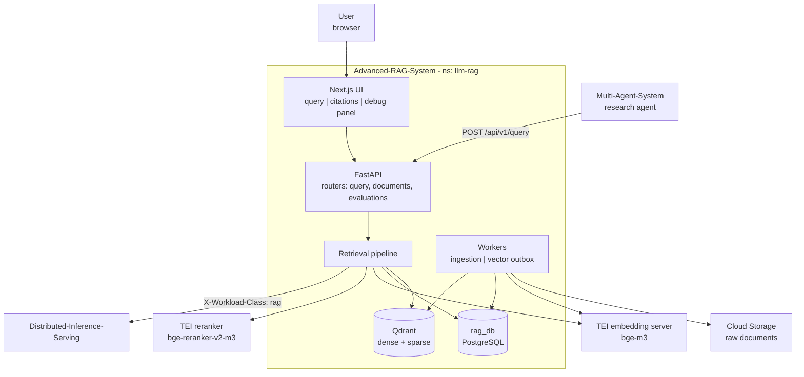
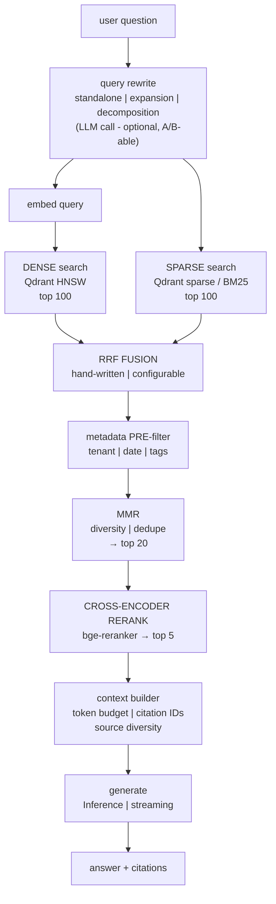
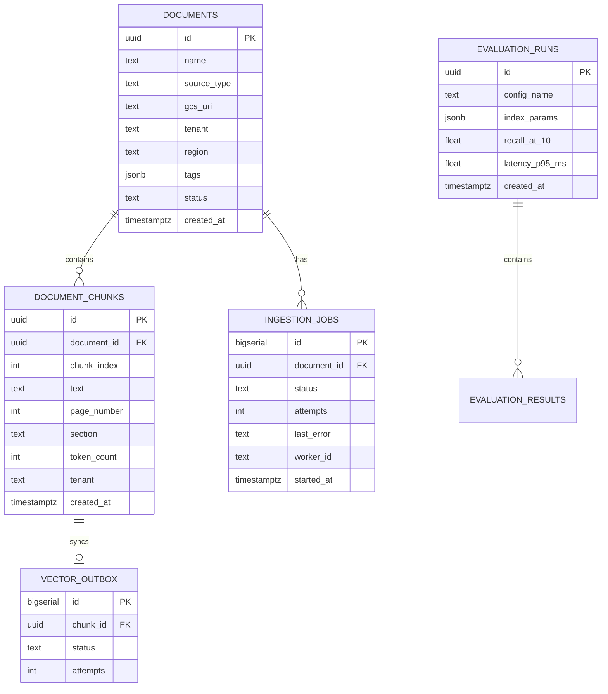
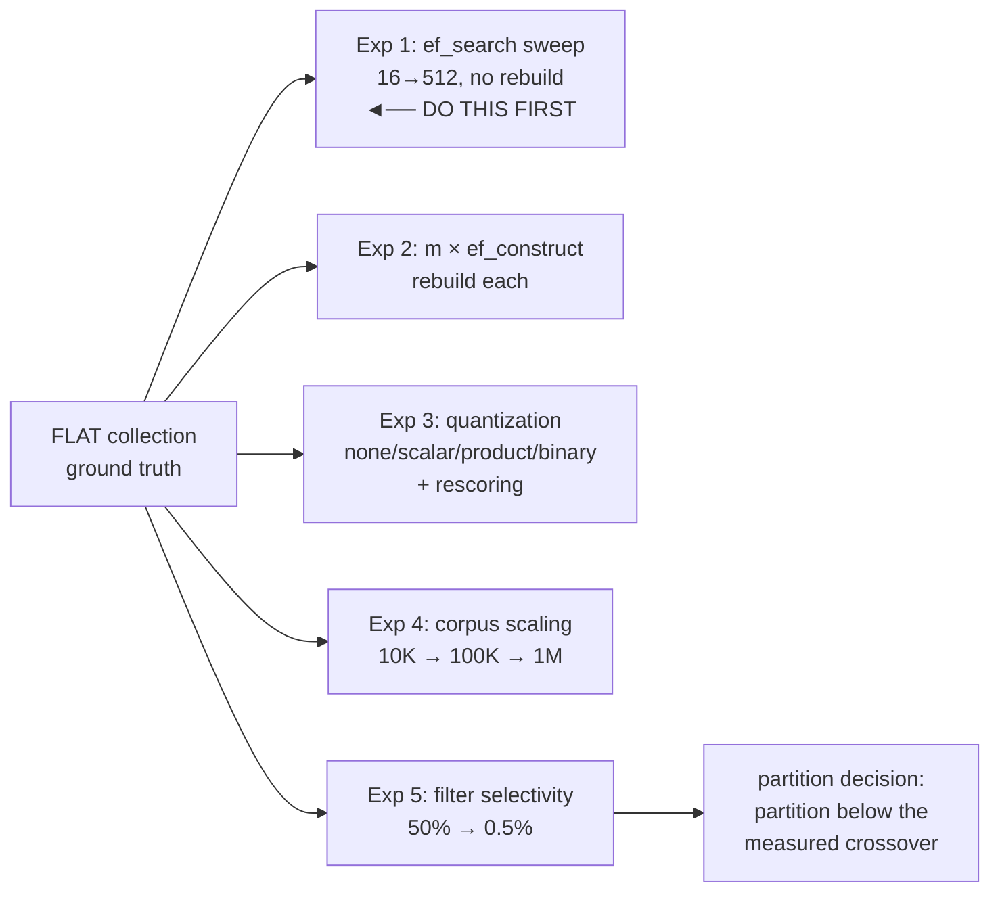

# Advanced RAG System - System PRD

| | |
|---|---|
| **Folder** | `Advanced-RAG-System/` |
| **Root PRD section** | Section 5 |
| **Namespace** | `llm-rag` |
| **Database** | `rag_db` (PostgreSQL) + **Qdrant** - both owned exclusively |
| **Base URL** | `https://rag.<domain>` |
| **Depends on** | `Distributed-Inference-Serving` (HTTP) **only** |
| **Consumed by** | `Multi-Agent-System`, via `/api/v1/query` **only** |
| **Publishes** | `openapi.json` → `platform-contracts/openapi/rag-v1.json` |
| **Build order** | **3rd** |
| **Status** | Planning |

> **This system is the sole owner of Qdrant and `rag_db`.** No other system connects to
> either. Multi-Agent reaches retrieval exclusively through the public HTTP API - that
> boundary is what makes both systems independently deployable.

---

## 1. Objective

Production-style retrieval-augmented generation over a large document collection, using
hybrid retrieval, fusion, diversity control, reranking, metadata filtering, and
citation-aware generation - with every stage independently measurable.

**Explicitly more than an embedding-search demo.** The measurable comparison of
retrieval strategies is the deliverable, not a side effect.

---

## 2. Architecture

### 2.1 System context



### 2.2 The query pipeline



> Every box emits `rag_stage_duration_seconds{stage=...}`. One Grafana panel then shows
> the whole pipeline, and instantly reveals that `generate` dwarfs everything - which is
> what stops you optimizing the reranker for a week.

### 2.3 Ingestion

```mermaid
sequenceDiagram
 autonumber
 participant U as Client
 participant A as RAG API
 participant P as rag_db
 participant W as Ingestion worker
 participant E as Embedding server
 participant Q as Qdrant

    U->>A: POST /documents (file)
    A->>P: store doc + enqueue ingestion_jobs
    A-->>U: 202 {document_id, status: pending}
    Note over A,U: returns immediately - never blocks on 90 min of work

    W->>P: claim job (FOR UPDATE SKIP LOCKED)
    W->>W: parse → clean → chunk
    W->>E: embed chunks (dense + sparse)
    W->>P: BEGIN: insert chunks + vector_outbox rows; COMMIT
    W->>P: mark job done

 loop outbox worker
        W->>P: read pending outbox rows
        W->>Q: upsert points (idempotent by chunk_id)
        W->>P: mark synced
 end
```

### 2.4 Data model



> **Postgres is the source of truth; Qdrant is a derived index.** That framing is what
> makes every index experiment in Section 7 safe - you can always drop and rebuild the
> collection.

---

## 3. Functional requirements

### 3.1 Ingestion
Formats: PDF, Markdown, TXT, HTML, DOCX where practical. Pipeline: validate → parse →
clean → chunk → embed → index → status tracking. Chunk metadata must map an answer back
to its source:

```
document_id | document_name | page_number | section | chunk_id
created_at | source_type | tags | tenant | region
```

> `tenant` and `region` are required **from day one**, even with one value each.
> Retrofitting a partition key means a full reindex (see Section 7.4).

### 3.2 Chunking
Configurable and A/B-able: fixed-token, overlap, sentence-aware, section-aware.
Chunk size must be an experiment parameter, not a constant.

### 3.3 Dense retrieval - Qdrant
Configurable top-K, HNSW with `m`, `ef_construct` exposed, `ef_search` tunable
**per query** without rebuild, scalar/product/binary quantization selectable, a
**flat collection** maintained as ground truth for Recall@K.

### 3.4 Sparse retrieval
Qdrant sparse vectors with client-computed BM25 weights (IDF from corpus statistics in
`rag_db`). Required for exact terms, proper nouns, IDs, acronyms, rare keywords.

### 3.5 Fusion, diversity, reranking
**RRF hand-written and configurable** (not server-side fusion - writing it is the
point). MMR for diversity and near-duplicate suppression. Cross-encoder reranker over
the top ~100 → top 5-20; **reranker score recorded** for debugging and evaluation.

### 3.6 Metadata filtering
**Pre-filtering only** - applied during graph traversal, never post-hoc. Post-filtering
silently returns 3 results when 97 fail the filter, which is a correctness bug, not a
performance issue. Filterable: document, date, category, tenant, source, tags,
permissions.

### 3.7 Query rewriting
Standalone-query generation, expansion, multi-query, decomposition, keyword and
entity extraction. **Must be switchable off** so it can be compared against direct
retrieval.

### 3.8 Context builder
Respect a token budget, dedupe, preserve source mapping, prioritize high-scoring
evidence, diversify sources, assign citation IDs, hard-prevent oversized prompts.

### 3.9 Debug panel
Developer mode surfaces every stage:

```
original query → rewritten query → dense results → sparse results
→ fusion scores → MMR selection → reranker scores → final context → answer
```

---

## 4. API contract

| Method | Path | Purpose |
|---|---|---|
| `POST` | `/api/v1/query` | **the contract Multi-Agent consumes** |
| `POST` | `/api/v1/documents` | upload → 202 |
| `GET` | `/api/v1/documents` | list + status |
| `GET` | `/api/v1/documents/{id}/status` | ingestion progress |
| `DELETE` | `/api/v1/documents/{id}` | cascade delete, incl. vectors |
| `POST` | `/api/v1/evaluations` | trigger an evaluation run |
| `GET` | `/api/v1/evaluations/{id}` | results |
| `GET` | `/health` `/ready` `/metrics` `/openapi.json` | standard |

### `POST /api/v1/query` - the public contract

```jsonc
// Request
{
  "query": "What were Q3 churn drivers?",
  "top_k": 5,
  "filters": {"tenant": "acme", "tags": ["finance"], "date_after": "2026-01-01"},
  "stream": false,
  "include_debug": false,
  "generate": true          // false → retrieval only, no LLM call
}
```

```jsonc
// Response
{
  "answer": "Churn in Q3 was driven by [1] pricing changes and [2] onboarding friction.",
  "citations": [
    {"id": 1, "document_id": "doc_42", "document_name": "Q3 Review.pdf",
     "page_number": 7, "chunk_id": "c_9f3a", "score": 0.91,
     "text": "Pricing changes in July correlated with..."},
    {"id": 2, "document_id": "doc_17", "document_name": "Support Notes.md",
     "page_number": null, "chunk_id": "c_2b1c", "score": 0.87, "text": "..."}
  ],
  "usage": {"prompt_tokens": 8421, "completion_tokens": 156},
  "timings_ms": {"rewrite": 420, "dense": 22, "sparse": 14, "fusion": 2,
                 "mmr": 5, "rerank": 168, "generate": 3100, "total": 3731}
}
```

> **`generate: false` matters.** The Multi-Agent research agent often wants passages,
> not prose - and skipping generation avoids a second LLM call inside an agent step.
> This is the single most important design decision in this contract.

Error `type` values: `document_not_found`, `ingestion_failed`,
`retrieval_unavailable`, `inference_unavailable`, `context_too_long`,
`invalid_filter`.

---

## 5. Degradation contract

| Dependency down | Required behavior |
|---|---|
| **Inference** | retrieval still works. Return citations with `answer: null` and `"degraded": "generation_unavailable"`. **Never a 500.** Multi-Agent can still use the passages |
| **Qdrant** | sparse/keyword path answers alone, degraded, and says so via `"degraded": "dense_unavailable"` |
| **Embedding server** | dense search unavailable → same as above. Ingestion queues instead of failing |
| **`rag_db`** | `/ready` fails, pod removed from Service. Fail fast |
| **Reranker** | skip reranking, return fusion order, flag `"degraded": "rerank_skipped"` |

> Every degraded response is explicitly labelled. A consumer must never have to guess
> whether it got a full-quality answer.

---

## 6. Non-functional requirements

| Metric | Target |
|---|---|
| Retrieval-only p95 (`generate: false`) | < 400 ms |
| Full query p95 (with generation) | < 5 s |
| Recall@10 vs flat ground truth | ≥ 0.93 |
| Ingestion throughput | ≥ 10 docs/min/worker |
| Citation correctness | 100% - every citation ID resolves to a real chunk |

---

## 7. Evaluation and index benchmarking

**The distinguishing deliverable of this system.**

### 7.1 Retrieval metrics
Recall@K, Precision@K, MRR, nDCG, reranker improvement (before/after), duplicate
rate.

### 7.2 Answer metrics
Correctness, faithfulness, citation correctness, citation coverage, hallucination
rate, latency.

### 7.3 Ground truth
A flat (exact) Qdrant collection over an evaluation subset. **Recall@K is undefined
without it** - build it first.

### 7.4 The index experiments



Every run records: index type, params, quantization, corpus size, Recall@1/10/50,
latency p50/p95/p99, QPS, **build time, index size, resident RAM**. Those last three
matter as much as recall - a 40-minute build is a different product from a 40-second
one.

> **Experiment 1 first.** One index, one query parameter, ~20 minutes, no rebuilds -
> and it produces the recall-vs-latency curve that tells you what a point of recall
> costs in milliseconds on *your* data.

### 7.5 Partitioning
Start with payload filters and an `is_tenant` payload index. Move to partition/shard
keys **only where Experiment 5 shows filtered search degrading**, and only where each
partition still holds ≥10K vectors. Below that, ANN stops helping and the partition is
pure overhead.

---

## 8. Observability

```
rag_stage_duration_seconds{stage} histogram - rewrite|dense|sparse|fusion|mmr|rerank|generate
rag_queries_total{status,degraded}
rag_context_tokens histogram  ◄── watch it creep upward
rag_retrieved_docs histogram
rag_rerank_score histogram  ◄── distribution shift = index drift
rag_citations_total
rag_recall_at_10 gauge (from nightly eval)
rag_ingestion_jobs_pending gauge  ◄── growing = workers dead
rag_ingestion_jobs_failed_total
rag_outbox_pending_total gauge  ◄── growing = Qdrant sync dead, retrieval going stale
rag_qdrant_errors_total
```

> `rag_outbox_pending_total` and `rag_ingestion_jobs_pending` are the two metrics that
> catch **silent** failure - no exception, no error rate, just quietly stale retrieval.

Trace spans: `rag.query` → `query.rewrite` → `retrieve.dense` → `retrieve.sparse` →
`fusion.rrf` → `mmr.select` → `rerank` → `context.build` → `llm.generate`.

---

## 9. Repository structure

```
Advanced-RAG-System/
├── backend/
│   ├── app/
│   │   ├── main.py
│   │   ├── api/{query,documents,evaluations,health}.py
│   │   ├── retrieval/{dense,sparse,fusion,mmr,rerank,context_builder}.py
│   │   ├── ingestion/{parse,chunk,embed}.py
│   │   ├── clients/{inference,qdrant,embedder,reranker}.py
│   │   ├── persistence/{models,repository}.py
│   │   └── observability/
│   ├── migrations/                    # owns rag_db
│   └── tests/{unit,integration,contract}/
├── workers/{ingestion_worker.py,outbox_worker.py,reaper.py}
├── evaluation/
│   ├── build_ground_truth.py
│   ├── experiments/{ef_sweep,hnsw_params,quantization,scaling,filtering}.py
│   └── results/                       ◄── committed
├── frontend/                          # Next.js: query, citations, debug panel
├── deploy/{docker,k8s}/
├── .github/workflows/{ci.yml,nightly-eval.yml}
├── docker-compose.yml
├── openapi.json                       ◄── consumed by Multi-Agent
└── README.md
```

---

## 10. Local development

```yaml
services:
 rag-api:    { build: ./backend, environment: { INFERENCE_URL: http://inference-stub:8000/v1 } }
 ingestion-worker: { build: ./backend, command: python workers/ingestion_worker.py }
 outbox-worker:    { build: ./backend, command: python workers/outbox_worker.py }
 postgres:   { image: postgres:16 }
 qdrant:     { image: qdrant/qdrant, ports: ["6333:6333"] }
 embedder:   { image: ghcr.io/huggingface/text-embeddings-inference }
 inference-stub: { image: ollama/ollama }
```

No other project required. Qdrant's dashboard at `localhost:6333/dashboard` is worth
keeping open while developing.

---

## 11. Build phases

| Phase | Deliverable | Exit criteria |
|---|---|---|
| 1 | Postgres schema, document upload → 202 | job rows created |
| 2 | Ingestion worker (SKIP LOCKED) | 500 PDFs process without blocking a request |
| 3 | Qdrant **flat** collection | ground truth for Recall@K exists |
| 4 | Dense HNSW + `/api/v1/query` | first Recall@10 number vs flat |
| 5 | **Experiment 1** - `ef_search` sweep | recall-vs-latency curve plotted |
| 6 | Sparse vectors + hand-written RRF | measured delta vs dense-only |
| 7 | MMR | measured delta |
| 8 | Cross-encoder reranker | measured delta |
| 9 | Metadata pre-filtering | filtered queries return full top-K |
| 10 | Context builder + citations | every citation ID resolves |
| 11 | Outbox worker + reaper + metrics | kill a worker mid-run, no data loss |
| 12 | Debug panel | all stages visible |
| 13 | Experiments 2-5 | committed results, partition decision made |
| 14 | Publish `rag-v1` | Multi-Agent can generate its client |

> **Measure Recall@10 at every step from phase 4 onward.** A retrieval change you didn't
> measure is a retrieval change you don't understand.

---

## 12. Acceptance criteria

- [ ] All listed formats ingest; status is trackable per document
- [ ] Ingestion is async, resumable, idempotent, and survives worker death
- [ ] Dense, sparse, and hybrid retrieval all work
- [ ] RRF, MMR, and reranking are **hand-written and configurable**
- [ ] Metadata **pre-filtering** works; filtered queries return the full requested top-K
- [ ] HNSW params and quantization are configurable and benchmarked
- [ ] A flat ground-truth collection exists; Recall@K is computed against it
- [ ] All five experiments run, with results committed
- [ ] Every retrieval stage is separately timed and visible in one Grafana panel
- [ ] Answers include citations; **every citation ID resolves to a real chunk**
- [ ] Debug panel exposes every intermediate stage
- [ ] `generate: false` returns passages without an LLM call
- [ ] **Degradation:** Inference down → retrieval still returns cited passages, labelled degraded
- [ ] `rag_db` and Qdrant are accessed by **no other system**
- [ ] `openapi.json` published as `rag-v1`
- [ ] **Deployable and rollback-able without rebuilding any other system**
